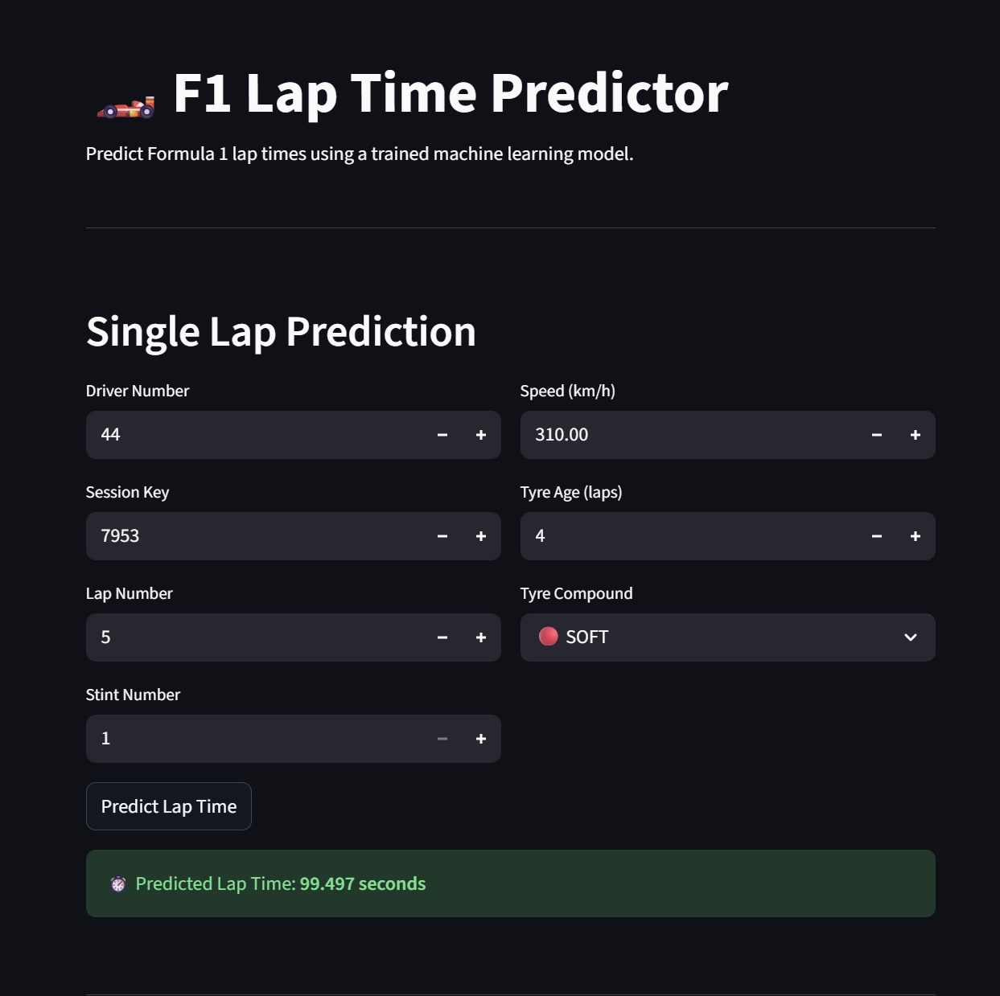

# 🏎️ F1 Lap Time Predictor

A machine-learning–based project that predicts Formula 1 lap times using race, driver, and stint information.  
The project includes a trained ML model, a prediction pipeline, and an interactive **Streamlit UI** for both single-lap and batch predictions.

## Project Features
- Predict lap times using a trained ML regression model
- Consistent preprocessing with label encoders from training
- Batch predictions from CSV files
- Interactive Streamlit UI
- Used OpenF1 API for data collection

.png)